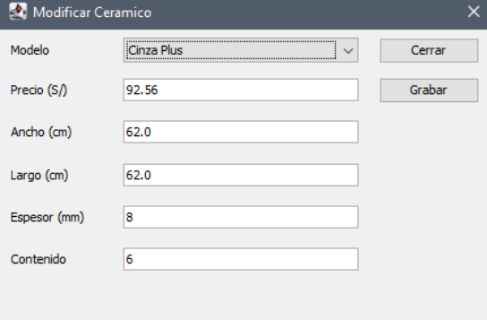
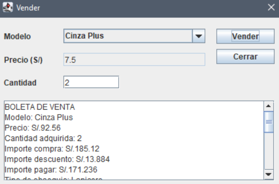
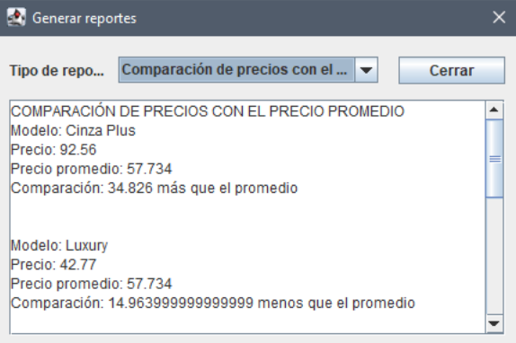

# Sistema de Ventas en Java

Proyecto desarrollado en Java utilizando Eclipse.

# Vista del sistema 

### Modificar 

### Ventana vender

### Generación de reportes

## Descripción
Sistema de ventas con interfaz gráfica que permite gestionar productos, ventas y reportes.

## Funcionalidades
- Registrar ventas
- Listar productos
- Modificar información
- Generar reportes

## Tecnologías
- Java
- Eclipse IDE
- Programación Orientada a Objetos

## Autor
Kristal Gamarra
